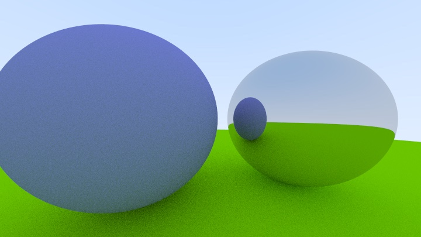
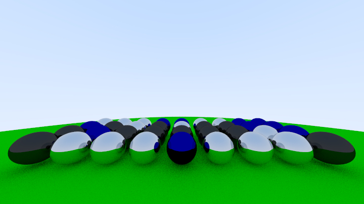
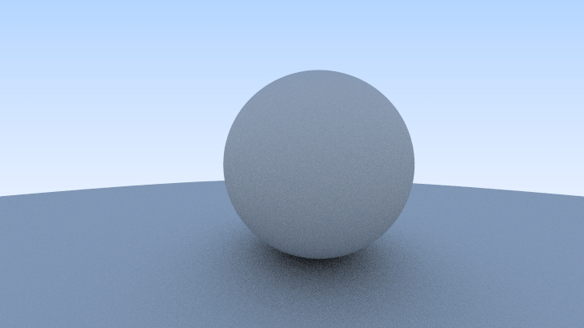
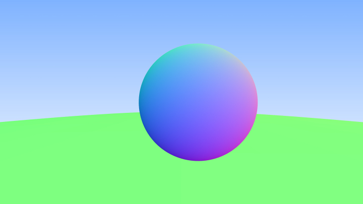
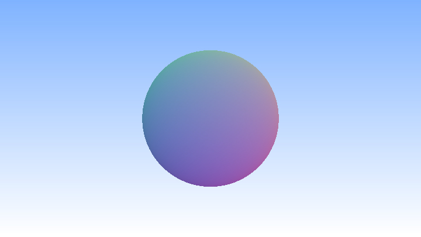

# raytracer [](https://github.com/joshaustintech/raytracer/actions/workflows/rust.yml)

Simple raytracer written in Rust

## Introduction

I'm following the online course *[Ray Tracing in One Weekend](https://raytracing.github.io/books/RayTracingInOneWeekend.html)*
but am using Rust instead of the example C++ code.

## Progress

### Reflective Material



### Shading ("Diffuse Materials")


### Edge Smoothing ("Antialiasing")


### Simple "World"


### Colored Sphere


### Initial Render


## Usage
### Build
```bash
cargo build
```
### Test
```bash
cargo test
```
### Run
```bash
cargo run
```
