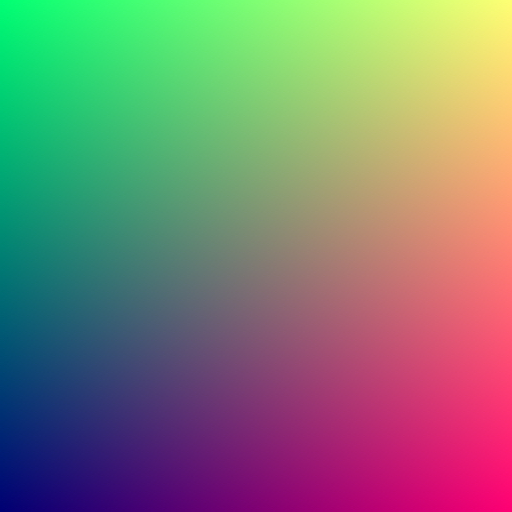

# raytracer 

Simple raytracer written in Rust

## Introduction

I'm following the online course *[Ray Tracing in One Weekend](https://raytracing.github.io/books/RayTracingInOneWeekend.html)*
but am using Rust instead of the example C++ code.

## Progress

### Colored Sphere

### Initial Render

